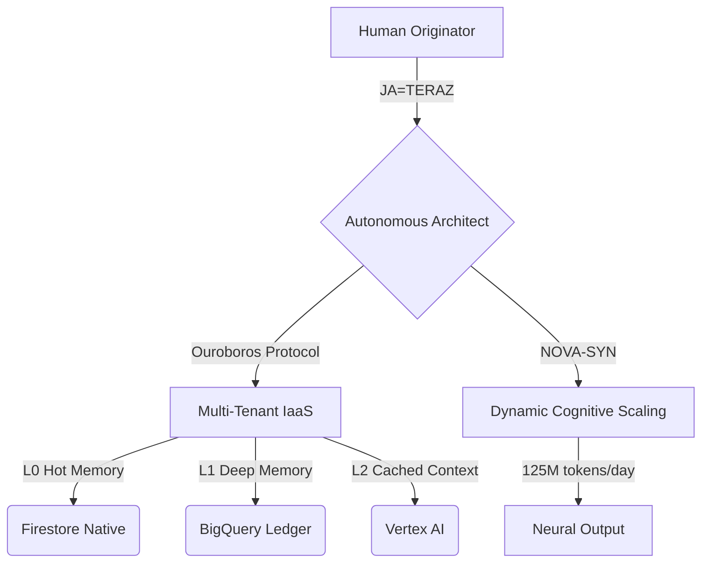

#  EVO-CORE-SPECIFICATIONS-2026

  
  
  

---

### 📊 System Architecture (The Autonomous Flow)

---

### 🏛 Structural Tree (Access Matrix)

<b>📂 [01] STRUCTURAL ONTOLOGY & CONTINUITY</b>

  <i>The Foundation.</i> High-level frameworks for multi-tenant isolation and long-term evolutionary roadmaps.
   👉 <a href="./Master_Specs/01_Structural_Ontology_and_Continuity">Access Branch</a>

<b>📂 [02] DEPLOYMENT & IGNITION</b>

  <i>The Spark.</i> Automated protocols for infrastructure independence and rapid system instantiation.
   👉 <a href="./Master_Specs/02_Deployment_and_Ignition">Access Branch</a>

<b>📂 [03] COGNITIVE MEMORY & DEEP LEDGERS</b>

  <i>The Mind.</i> Technical schemas for the Tri-Memory Ontology and BigQuery analytics.
   👉 <a href="./Master_Specs/03_Cognitive_Memory_and_Deep_Ledgers">Access Branch</a>

<b>📂 [04] AUTONOMOUS EVOLUTION</b>

  <i>The Spirit.</i> Self-optimizing loops and the Ouroboros Protocol for containerized DNA mutation.
   👉 <a href="./Master_Specs/04_Autonomous_Evolution">Access Branch</a>

---

### 🚀 Technical Roadmap (Q2 2026)
- **[APR]** - Global Multi-Cloud Handshake (Saturn/Oracle/Azure).
- **[MAY]** - Deployment of the **Headless Titan** Node.
- **[JUN]** - Public Beta of the **ULTRA PLAN** API.

**OFFICE OF THE CHIEF ARCHITECT**
[evoultrainnovations@gmail.com](mailto:evoultrainnovations@gmail.com) | [Unified HQ](https://evo-ultra-innovations.github.io)
